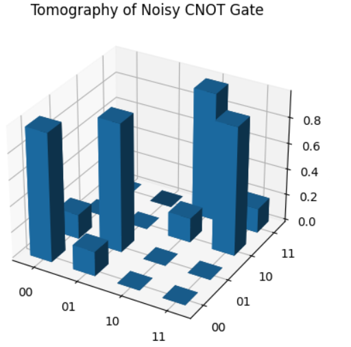

# Quantum-information-and-computing

Implementation 2-qubit gates with charge superconducinng qubits and build the Deutsch algorithm based on paper [Demonstration of conditional gate operation using superconducting charge qubits](https://arxiv.org/abs/cond-mat/0311067) and [Quantum algorithms for Josephson networks](https://arxiv.org/abs/cond-mat/0105169)

## 2 qubit implementation coupled with Josephson junction
- The integration of a 2-qubit system coupled with Josephson junctions marks a pivotal stride in quantum computing. Josephson junctions, as superconducting devices, enable controlled interactions between qubits, forming the basis for quantum gates and entanglement. This coupling enhances quantum coherence and stability, crucial for reliable quantum computation.
- **Description:** The detailed file can be represented in .ipynb files `Two-qubit-gate-implementation.ipynb`, `Eigenenergies of JJ.ipynb` and .py file `heq.py`.
  
 

## Deutsch-Jozsa algorithm
- The Deutsch-Jozsa algorithm, a milestone in quantum computing, efficiently determines whether a given function is constant or balanced with just one query. In contrast to classical algorithms requiring multiple queries, this quantum algorithm showcases the speedup potential of quantum parallelism, offering a tangible advantage in specific computational tasks.
- **Description:** The detailed file can be represented in .ipynb files `deutsch_algo_with_actual_gates.ipynb` and `2 qubit Deustch algorithm.ipynb`.
  
 
